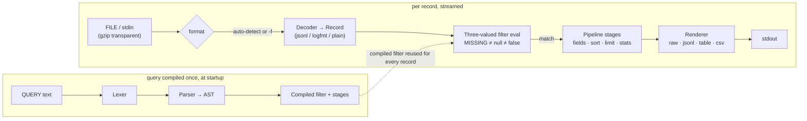

<div align="center">


[](go.mod)
[](STDLIB.md)
[](https://github.com/pooja-conqueror/LOGQ/actions/workflows/ci.yml)
[](#testing--ci)
[](#zero-dependency-hackathon-2026)
[](.zero-dep.toml)
[](LICENSE)


```
logq [flags] 'QUERY' [FILE|- ...]
```

</div>

**In plain terms:** `logq` is a command-line tool that lets you search,
filter, and summarize log files the way you'd query a database — grouping,
counting, percentiles, time windows — without installing a database, a
search cluster, or any third-party software at all. Point it at a log file
and write one line describing what you want; it prints the answer.

`logq` filters, windows, and computes percentiles over log files bigger than
RAM, from one static binary built from one empty manifest. It speaks JSONL,
logfmt, and plain text natively, treats a missing field as distinct from a
JSON `null`, and gives `level` fields ordinal comparisons
(`level >= "warn"` just works). Every format, and the query language itself,
is hand-written against the Go standard library — no parsing, CLI, or
aggregation package anywhere in the dependency graph.

**Status:** feature-complete for this Track B submission — every phase in
the build plan has landed, and this README (along with `STDLIB.md`,
`GRAMMAR.md`, and `BENCHMARKS.md`) reflects the code as of this commit, not
an earlier snapshot. "Honest Limits" below still lists the handful of
deliberate, disclosed scope cuts — nothing hidden, nothing half-wired.

## Zero Dependency Hackathon 2026

- **Track:** B — Parsers & Data Formats
- **Language:** Go, stdlib only (`go.mod` has no `require` block, ever)
- **Declared bonus:** Reproducible Build (+5) — `make repro-check` builds
  twice with identical flags and diffs the SHA-256 hashes; both builds
  produced the identical hash on this machine (see the Makefile's own
  comment for the actual value). STDLIB Log and Package Killer land
  organically from `STDLIB.md`'s real substitutions rather than being
  separately chased.
- See [`STDLIB.md`](STDLIB.md) for every package this project would
  normally have pulled in, and what it uses from the standard library
  instead — 24 rows, gjson's importer count re-verified live against
  pkg.go.dev this session.

### 30 seconds, real output, no cherry-picking

```console
$ logq 'level == "error" and status >= 500' app.jsonl
{"ts":"2026-08-30T09:12:04Z","level":"error","service":"checkout","path":"/api/v1/orders","status":500,"duration_ms":812}
{"ts":"2026-08-30T09:12:07Z","level":"error","service":"billing","path":"/api/v1/charge","status":502,"duration_ms":991}
{"ts":"2026-08-30T09:12:11Z","level":"error","service":"checkout","path":"/api/v1/orders","status":500,"duration_ms":734}

$ logq -o table '| stats count(), p95(duration_ms) by service | sort count desc limit 3' app.jsonl
service   count  p95_duration_ms
checkout      4              812
auth          1              118
billing       1              991

$ logq 'status >==' app.jsonl
logq: 1:10: E-PARSE: unexpected '='; did you mean '=='?
```

Every line above is captured verbatim from the compiled binary against a
7-line fixture — not hand-typed. No screen recorder in this dev environment
to turn it into a GIF (disclosed, not hidden — see
[Honest Limits](#honest-limits)), so this is the honest version instead:
copy-pasteable, and true.

## Table of Contents

- [Zero Dependency Hackathon 2026](#zero-dependency-hackathon-2026)
- [Determinism, stated up front](#determinism-stated-up-front)
- [How a query flows through logq](#how-a-query-flows-through-logq)
- [Where logq fits](#where-logq-fits)
- [Install / Build](#install--build)
- [Repository Layout](#repository-layout)
- [Usage](#usage)
- [Query Language](#query-language)
- [Testing & CI](#testing--ci)
- [Honest Limits](#honest-limits)
- [License](#license)

## Determinism, stated up front

> [!IMPORTANT]
> Batch mode (the default — no `-w`/`--watch`) produces **byte-identical
> stdout** for identical (input bytes, query, flags, version), full stop —
> `now()` frozen once at process start, deterministic group ordering, a
> fixed reservoir seed for percentiles.
>
> Watch mode (`-w`) is explicitly, deliberately **exempt** from that
> guarantee: it's a live, best-effort view by design — `now()` is
> re-evaluated every poll (so a relative bound like `--since -1h` tracks a
> genuine rolling window instead of freezing), and a `stats` query's
> accumulated result is re-emitted as a growing `SNAPSHOT` every poll rather
> than a single final answer. Comparing two watch-mode runs byte-for-byte
> was never the goal; comparing two batch-mode runs is.

## How a query flows through logq



Decode → filter → stage → render is one pass per record, so a plain filter
query never buffers more than the current line — see
[`BENCHMARKS.md`](BENCHMARKS.md) for the measured proof (heap growth stays
flat across a 10x input-size increase).

## Where logq fits

|  | `grep` / `awk` | `jq` | Splunk / ELK | **logq** |
|---|:---:|:---:|:---:|:---:|
| Structured field access (`a.b[0]`) | ❌ | ✅ | ✅ | ✅ |
| `MISSING` field ≠ JSON `null` | ❌ | partial | ✅ | ✅ |
| `level >= "warn"` ordinal comparison | ❌ | ❌ | manual | ✅ |
| Aggregation (`stats`, percentiles, windowing) | ❌ | manual | ✅ | ✅ |
| Positioned errors ("did you mean `==`?") | ❌ | partial | n/a | ✅ |
| Streams input bigger than RAM | ✅ | ✅ | ✅ (infra) | ✅ |
| Setup | none | none | a cluster | **one static binary** |
| Runtime dependencies | — | — | many | **zero** |

Not a Splunk replacement — no storage, no UI, no distribution. It's the tool
for the fifteen seconds between "I have a log file" and "I have an answer,"
with the structured-query power `grep`/`awk` don't have and none of the
infrastructure Splunk/ELK do.

## Install / Build

```sh
go build -trimpath -buildvcs=false -o bin/logq ./cmd/logq
```

(A `Makefile` target wraps this: `make build`.)

## Repository Layout

```
cmd/logq/            CLI entry point — flags, exit codes, signals, main.go
internal/lex/        Position-tracked lexer
internal/query/      Recursive-descent parser → AST, grammar
internal/eval/       Three-valued filter evaluator, coercions, timestamps
internal/formats/    JSONL/logfmt/plain decoders, line splitting, gzip
internal/logfmtx/    Hand-written logfmt state machine
internal/pipeline/   Stage chaining — fields, sort, limit, stats
internal/agg/        Aggregators — count/sum/avg/percentiles/windowing
internal/render/     Output formats — raw/jsonl/table/csv, ANSI color
internal/watch/      Portable poll-based file tailing (-w)
internal/summarize/  End-of-run diagnostic counters
internal/corpus/     Synthetic log generator (soak test + benchmarks)
tests/golden/        Black-box subprocess test suite, byte-exact output
tests/chaos/         Adversarial edge-case test suite
scripts/             Dev-only tooling (corpus generator, differential QA)
```

Every package above is small and single-purpose on purpose — `internal/`
has no "utils" or "common" catch-all. `STDLIB.md` explains what each one
replaces; `GRAMMAR.md` is the query language's frozen EBNF.

## Usage

```sh
logq --version
logq --help

# filter JSONL from a file, exact-match and numeric comparisons
logq 'level == "error"' app.jsonl
logq 'status >= 500' app.jsonl

# level fields compare ordinally, not alphabetically
logq 'level >= "warn"' app.jsonl      # "error" (50) >= "warn" (40) -> true

# nested field access, array indexing, boolean combinators, regex, membership
logq 'url.path == "/api/x"' app.jsonl
logq 'items[0] == "first"' app.jsonl
logq 'level == "error" and not exists(handled)' app.jsonl
logq 'msg ~ "auth failed"' app.jsonl
logq 'status in [500, 502, 503]' app.jsonl

# stdin, gzip, logfmt/plain — all auto-detected or forced with -f
cat app.jsonl | logq 'level == "error"'
logq 'level == "error"' app.jsonl.gz
logq -f logfmt 'level == "error"' app.log

# stats: group-by aggregation + top-K over the aggregate groups
logq 'status >= 500 | stats count(), p95(duration_ms) by url.path' app.jsonl
logq '| stats count() by url.path | sort count desc limit 10' app.jsonl

# -j/--workers shards stats' own aggregation math (byte-identical to -j 1)
logq -j 4 '| stats count(), avg(duration_ms) by url.path' huge.jsonl

# -w/--watch: poll for new content, live now() re-evaluation (see Determinism above)
logq -w 'level == "error"' app.log
```

<details>
<summary><strong>Full flag & example reference</strong> — every flag, every output format, timestamps/timezones, watch mode, error handling, color, query-file input (click to expand)</summary>

```sh
# a string field compares numerically against a number literal — the
# sanctioned string<->number coercion, not a type error
logq 'status >= 500' app.jsonl        # matches status: "502" too

# boolean combinators with explicit parens
logq '(a == 1 or b == 2) and c == 3' app.jsonl

# read from stdin explicitly with "-"
logq 'level == "error"' -

# re-serialize matches as JSON instead of raw passthrough
logq -o jsonl 'level == "error"' app.jsonl
logq -f plain 'msg ~ "auth failed"' app.log

# "ts" is a virtual field: it always means the record's resolved timestamp
# (from whichever of ts/time/timestamp/@timestamp/t/eventTime actually
# parsed), never a literal field that merely happens to be named "ts" —
# compare it with a duration, relative to the run's frozen "now"
logq 'level == "error" and ts >= -1h' app.jsonl
logq 'exists(ts)' app.jsonl

# --since/--until drop records outside a time window; a record with no
# resolvable timestamp at all is dropped too, once either flag is set
logq --since 2026-08-29T00:00:00Z 'level == "error"' app.jsonl
logq --until now --since -24h 'exists(ts)' app.jsonl

# --tz interprets naive (no zone offset) timestamps in a given IANA zone;
# the zone database is embedded in the binary (time/tzdata) — works even
# on a host with no system tzdata installed at all
logq --tz America/New_York 'exists(ts)' app.jsonl

# -o table / -o csv: human-scannable table (numeric columns right-aligned,
# missing fields shown as "(missing)") or RFC 4180 CSV (missing AND null
# both render as an empty cell — use -o jsonl instead to keep that distinct)
logq -o table 'level == "error"' app.jsonl
logq -o csv 'level == "error"' app.jsonl

# pipeline stages chain left to right: project fields, then sort
logq -o jsonl 'level == "error" | fields ts, msg' app.jsonl
logq -o jsonl 'status >= 500 | sort status desc limit 10' app.jsonl

# limit (bare, or via sort ... limit) stops reading input as soon as it's
# satisfied — including skipping any FURTHER files entirely, since the
# pipeline is one shared instance across the whole run, not per file
logq -o jsonl 'exists(n) | limit 5' a.jsonl b.jsonl c.jsonl

# once any stage runs, -o raw's byte-for-byte guarantee no longer makes
# sense — it falls back to jsonl serialization of the final record instead
logq 'level == "error" | fields msg' app.jsonl   # prints jsonl, not raw bytes

# "every" adds an event-time window (civil-day/DST-safe for windows >= 24h)
# as an extra grouping dimension, bucket first
logq '| stats count() by service every 1h' app.jsonl

# -w=5: 5s poll interval, growing SNAPSHOT re-emitted every poll
logq -w=5 '| stats count() by service' app.log

# --on-error: skip = silent, warn = default (count + summary line), stop =
# abort on the first malformed/oversized line, exit 3. -f jsonl forced
# explicitly here since a mix of valid/corrupted lines would otherwise fail
# auto-detection's own all-or-nothing cascade entirely (see Usage notes below)
logq -f jsonl --on-error stop 'exists(x)' app.jsonl

# -C/--no-color (or NO_COLOR=1): disable stderr's small ANSI palette — never
# applied to redirected/piped output either way, only a real tty
logq -C 'level == "error"' app.jsonl

# -q/--quiet: suppress PARTIAL/summary/SNAPSHOT stderr chatter — real errors
# (a compile failure, an --on-error stop abort) still print
logq -q 'level == "error"' app.jsonl

# -Q/--query-file: keep a sensitive query out of the process list (ps
# aux/docker top can read plain argv) — "-" reads the query from stdin
# instead of a file; every remaining positional arg is then a log FILE
logq -Q query.txt app.jsonl
echo 'level == "error"' | logq -Q - app.jsonl
```

`-f`/`--format` accepts `auto` (default — samples the first 64 non-empty
lines of *each source independently* and picks jsonl/logfmt/plain
deterministically; a single line that doesn't fit disqualifies a format
outright, no fuzzy scoring) or one of `jsonl`/`logfmt`/`plain` forced
explicitly. `-o`/`--output` accepts `raw`/`jsonl`/`table`/`csv`. Anything
else fails fast with a clear error rather than silently misbehaving.

Auto-detection is genuinely all-or-nothing per the spec: if even one line in
the sampled window doesn't fit a format, the whole source falls through to
the next one in the cascade (jsonl → logfmt → plain). A source that's mostly
clean JSONL with one corrupted line among the first 64 will therefore be
detected as plain text, not jsonl-with-one-bad-line — force `-f jsonl`
explicitly if that's not what you want.

Results go to stdout only. Diagnostics (a query compile error, a per-run
malformed-line count) go to stderr, never mixed into stdout.

</details>

## Query Language

The full frozen EBNF, truth tables, and windowing semantics are in
[`GRAMMAR.md`](GRAMMAR.md). Both halves of the language are fully
implemented and tested: the filter half (comparisons, `and`/`or`/`not`,
`exists()`, `in [...]`, regex match, nested paths — see
`internal/query/parser.go` and `internal/eval/eval.go`) and the
pipeline-stage half (`fields`, `sort`, `limit`, `stats` — see
`internal/query/parser.go` and `internal/pipeline/`).

Three-valued logic is the one semantic worth calling out here explicitly —
`MISSING` (the field doesn't exist on this record) is a distinct third
state, never conflated with JSON `null` or coerced into an error:

| `field` in record | `field == 1` | `exists(field)` | `field == null`\* |
|---|:---:|:---:|:---:|
| absent (`MISSING`) | `false` | `false` | `false` |
| present, JSON `null` | `false` | `true` | `true` |
| present, `1` | `true` | `true` | `false` |

\* `null` is a reserved literal, matched only by a field genuinely present
with JSON `null` — never by a missing one.

Every comparison involving `MISSING` evaluates to `false` — never an error —
so a query never aborts partway through a file just because one record has
a different shape than the rest.

## Testing & CI

```sh
go test ./...  # everything: 746 tests, 14 packages
make test        # same, via the Makefile target
```

[`tests/golden/`](tests/golden) is a from-scratch, dependency-free black-box
test runner: it builds the real `logq` binary once, then runs it as a real
subprocess against each fixture directory under `tests/golden/testdata/` —
comparing stdout, stderr, and exit code byte-exact against checked-in golden
files. Covers filter/stats/windowing/top-K queries, all four output
formats, gzip and logfmt input, `--on-error stop`, `--max-groups` overflow,
`--levels` overrides, the `MISSING`/`Null`/empty-string three-way
distinction, and a usage-error exit code.

[`tests/chaos/`](tests/chaos) (same real-subprocess pattern) and
`cmd/logq/chaos_test.go` (in-process, for the one scenario — mid-stream
interrupt timing — a real subprocess can't test deterministically) push
logq under adversarial conditions: a truncated mid-stream gzip file,
hundreds of oversized lines interleaved with valid ones, a 5,000-group `-j`
determinism check, and an interrupt landing at an exact line count
mid-volume. `FuzzParseQuery` and `FuzzLogfmtRoundTrip` fuzz the parser and
the logfmt round-trip property natively (`make fuzz`, 30s each).
`cmd/logq/soak_test.go`'s `TestSoak_MemoryStaysBoundedAcrossCorpusScale`
runs automatically on every `go test ./...` and asserts heap growth stays
flat across a 10x input-size increase; `make soak-manual` runs the same
claim at real scale against a generated ~2GB corpus. Real, actually-measured
throughput numbers — wins and losses both — are in
[`BENCHMARKS.md`](BENCHMARKS.md).

<details>
<summary><strong>make cover · make repro-check · make verify-differential · CI details</strong> (click to expand)</summary>

`make cover` runs `go test -coverprofile` scoped to `./internal/...` and
gates on ≥85% line coverage — **89.6% measured** on this machine on
2026-08-30, the same command CI's `coverage` job runs. `make repro-check`
is the declared Reproducible Build bonus: build twice with identical flags,
`sha256sum` both, fail if they differ (verified locally). `make
verify-differential` is an opt-in QA harness
([`scripts/verify-differential.sh`](scripts/verify-differential.sh))
cross-checking a handful of filter queries (`exists()`/`==`/`>=`) against
`jq` as an independent oracle; disclosed in `STDLIB.md`'s Disclosures
section as dev-only tooling, and deliberately never wired into
`make test`, `make build`, or CI — it skips itself cleanly if `jq` isn't
installed.

This dev environment has neither a C compiler nor `make` itself installed —
every Makefile target above was verified by running its underlying
`go`/shell commands directly and confirming the same result, not via an
actual `make` invocation; CI's Linux runners have both.

**CI** ([`.github/workflows/ci.yml`](.github/workflows/ci.yml)): build+test
run on a linux/macos/windows matrix; `coverage`, `race`, `fuzz-smoke`,
`proof` (deps-proof.txt regenerated fresh and asserted empty), and
`repro-check` each run as their own job, `race` and the rest on
`ubuntu-latest` specifically since that's the one runner guaranteed to have
a C compiler — this project's own dev environment doesn't, so `-race`
itself could only be validated by inspection and by running its
non-instrumented counterpart locally, not by an actual passing `-race` run
in this session; the workflow is wired to run it in CI, but no CI run has
executed yet to confirm that pass as of this commit.

</details>

## Honest Limits

<details open>
<summary><strong>What's actually implemented as of this commit</strong> — every deliberate, disclosed scope cut (click to collapse)</summary>

- **Input formats:** JSONL, logfmt, plain text, gzip transparency, and
  auto-detection are all implemented now (Phase 5 complete).
- **Output formats:** all four are implemented — `raw` (byte-verbatim
  passthrough), `jsonl` (re-serialized, key order preserved), `table`
  (aligned text via `text/tabwriter`, numeric columns right-aligned), and
  `csv` (RFC 4180). `table`/`csv` buffer every matched record — unlike
  `raw`/`jsonl`, they can't stream row-by-row, since the header must print
  before any row and depends on having seen the records first. For a truly
  huge passthrough result this means holding the whole result set in
  memory before printing anything; their natural use case is
  already-bounded aggregate output — e.g. `stats` results — where this
  doesn't matter.
- **Pipeline stages:** `fields`, `sort`, `limit`, and `stats` are fully
  wired now. `stats` supports `count()`, `count_distinct()`, `sum()`,
  `avg()`, `min()`, `max()`, `p50()`/`p95()`/`p99()`, an optional `by
  <paths>` grouping clause, and an optional `every DURATION` event-time
  window (civil-day/DST-safe alignment for windows >=24h — see
  `internal/agg/windowing.go`). `stats` is still the terminal aggregation
  stage — `fields` or a second `stats` can't follow it — but `sort`/`limit`
  explicitly can, reusing the same bounded-heap `Sort`/`Limit` stages
  unchanged for top-K over aggregate groups, e.g.
  `stats count() by url.path | sort count desc limit 10`. A group-key
  cardinality guard (`--max-groups`, default 10000) collapses overflow
  keys into a single `(other)` row; `count_distinct` inside `(other)`
  reports an empty-set marker rather than a merged (and misleading) count.
  `limit`/a bounded `sort ... limit N` even stop reading further input
  (including later files entirely) once satisfied, since the pipeline is
  one shared instance across the whole run, not rebuilt per file.
  `p50`/`p95`/`p99` are exact under `--max-sample` (default 100000),
  approximate beyond it with a `*`-marked cell, drawn from a fixed-seed
  (`--seed`, default 0) reservoir so approximate output stays reproducible
  across runs. `--levels name=NUM,...` extends/overrides the level-ordinal
  table (§6.2) used by `level >= "warn"`-style comparisons.
- **Time features:** `--tz`/`--since`/`--until` and real timestamp
  auto-detection (via the field-priority ladder, exposed as the virtual
  `ts` path) are implemented now (Phase 6 complete). `now` is frozen once
  at process start in batch mode; watch mode re-evaluates it every poll
  instead — see [Determinism, stated up front](#determinism-stated-up-front).
- **Signals:** `SIGINT`/`SIGTERM` are wired — the first one stops reading
  new input, flushes whatever partial results already exist (labeled
  `PARTIAL` on stderr), and exits 130; a second one within 2 seconds exits
  immediately with no flush guarantee. A closed downstream pipe
  (`logq ... | head -1`) exits 0 silently, never an alarming "write error"
  — verified against the real binary (`PIPESTATUS` shows logq's own exit
  code is 0, stderr empty).
- **Parallelism:** `-j`/`--workers N` parallelizes stats' own per-group
  aggregation math across N goroutines, each with an independent,
  lock-free `*Stats` shard over a disjoint slice of the group-key space
  (sharded by hashing the record's own group key, so a given group always
  lands on the same shard — never a round-robin split that would need
  merging partial aggregate state for the same group back together) — the
  rest of the pipeline (decoding, filtering) stays single-threaded
  regardless of `-j`. Verified byte-identical output between `-j 1` and
  `-j N` for N up to 16 over a 2000-record fixture. One honest scoping
  exception: the cardinality guard (`--max-groups`) is enforced per-shard,
  not globally, so `-j N>1` can emit up to N separate `(other)` rows in a
  genuine overflow instead of sequential mode's one. `-race` itself could
  not be run in this dev environment (no C compiler; `-race` needs cgo) —
  the concurrent-access tests (`tests/chaos/`, `cmd/logq/chaos_test.go`'s
  high-cardinality/-j cases) exist and the sharded design is reasoned to
  be race-free (each shard's state is touched only by its own owning
  goroutine, all cross-goroutine communication is via channels), but a
  passing `-race` run itself has only been *configured* (CI's `race` job,
  `ubuntu-latest`, which does have a C compiler), not yet actually
  observed — no CI run has executed as of this commit. `BENCHMARKS.md`
  also has a real, measured surprise here: `-j N` is not a throughput win
  at the scales tested (only stats' own aggregation is sharded; JSON
  decode, the actual bottleneck, stays single-threaded regardless of `-j`)
  — read it before reaching for `-j` expecting a speedup.
- **Watch mode (`-w`/`--watch[=SECONDS]`):** implemented — portable
  poll-tail (`os.Stat` + `os.SameFile`, default 1s interval), no fsnotify.
  Correctly detects and reopens across both rotation styles: a file
  deleted and recreated (bigger or smaller), and copytruncate (truncated
  in place). Requires at least one real `FILE` argument, not stdin.
  `--format auto` still works — detected once from the file's existing
  content at watch start, separately from where tailing itself begins
  (which always skips existing content, `tail -f` style — new activity
  only). `-j`/`--workers` is not honored under `-w` (always sequential
  stats). Line splitting in watch mode is a smaller rule set than batch
  mode's `LineReader`: `\n` splitting and CRLF-stripping only, no
  BOM-strip, no oversized-line skip-and-count — a deliberate, documented
  scope cut, not an oversight. A genuine Windows-only bug was found and
  fixed while building this: Go's plain `os.Open` on Windows doesn't set
  `FILE_SHARE_DELETE`, which would have meant an external log rotator
  could never delete or rename a file `logq -w` was watching, for as long
  as logq kept it open — fixed via a Windows-specific `syscall.CreateFile`
  open (stdlib only, no dependency) that explicitly requests it;
  empirically confirmed broken beforehand and fixed afterward on this dev
  machine.
- **Error/summary model (`--on-error skip|warn|stop`, default `warn`):**
  every non-fatal counter (`internal/summarize`) — malformed lines,
  oversized lines, jsonl duplicate keys, `--since`/`--until` drops,
  unparseable timestamp candidates, `--max-groups` overflow — is folded
  into one end-of-run stderr line, red when a real decode failure
  occurred. `skip` still counts internally but suppresses that line
  entirely; `warn` (default) prints it; `stop` aborts on the FIRST
  malformed or oversized line specifically, exit 3 — a ts-unparsed
  candidate is never fatal under any mode ("time fields aren't errors").
  Not yet wired: the finer-grained `skipped_nonnumeric{fn,field}`
  per-aggregate-function counters the spec also mentions — would need
  threading through every aggregator wrapper in
  `internal/pipeline/stats.go`, deliberately left for later rather than
  half-wired now.
- **Depth/size/query limits:** JSON nesting (default 32, `--max-depth`),
  oversized lines (default 1MB, up to 16MB, `--max-line`), and query text
  length (default 8192 characters, up to 65536, `--max-query`) are all
  configurable now. A line or query exceeding its limit is skipped/
  rejected and counted — never silently truncated.
- **Color (`-C`/`--no-color`):** stderr diagnostics (the counter summary,
  `PARTIAL`, watch mode's `SNAPSHOT`/stopped messages) get a small ANSI
  SGR palette — never stdout's actual data output, on any output format.
  Auto-detected via a portable, stdlib-only tty check
  (`os.ModeCharDevice` on the underlying `*os.File`, no isatty
  binding/dependency needed); honors [`NO_COLOR`](https://no-color.org)
  (any value, even empty) and `-C`/`--no-color` on top of that. Never
  active for redirected/piped output regardless of flags — verified color
  never leaks into non-tty stderr.
- **`-q`/`--quiet` and `-Q`/`--query-file`:** implemented. `-q` silences
  the informational stderr chatter (`PARTIAL`, the counter summary, watch
  mode's `SNAPSHOT`/stopped messages) — genuine errors (a compile
  failure, an `--on-error stop` abort, a write failure) always still
  print, `-q` isn't a way to hide a real failure. `-Q FILE`/`-Q -` reads
  the query from a file or stdin instead of argv, the same `mysql
  -p`-style mitigation for a query containing a token/credential fragment
  (plain argv is readable by any local user via `ps aux`/`docker top`) —
  when set, every remaining positional argument is a log `FILE`, never
  the query.
- **This README's own visuals:** no screen-recording toolchain (vhs /
  asciinema / ffmpeg) is available in this dev environment, so the demo
  above is real captured text output, not an animated terminal GIF —
  disclosed rather than faked. The header banner, typing tagline, and
  badges are generated by three well-established, free, no-auth GitHub
  README services (`capsule-render`, `readme-typing-svg`, `shields.io`) —
  no local rendering pipeline of our own was needed or written for them.

Nothing above is hidden or silently degraded — every one of these either
fails with a clear, explicit "not yet supported" message or is documented
here plainly.

</details>

## License

[](LICENSE)

MIT — see [`LICENSE`](LICENSE).

<div align="center">


</div>
